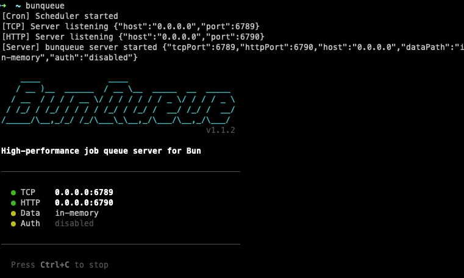

<p align="center">
  
</p>

<p align="center">
  <a href="https://github.com/egeominotti/bunqueue/actions"></a>
  <a href="https://github.com/egeominotti/bunqueue/releases"></a>
  <a href="https://github.com/egeominotti/bunqueue/blob/main/LICENSE"></a>
</p>

<p align="center">
  <a href="https://egeominotti.github.io/bunqueue/"><strong>📚 Documentation</strong></a> •
  <a href="#features">Features</a> •
  <a href="#quick-start">Quick Start</a> •
  <a href="#embedded-mode">Embedded</a> •
  <a href="#server-mode">Server</a> •
  <a href="#docker">Docker</a>
</p>

<p align="center">
  <a href="https://www.npmjs.com/package/bunqueue"></a>
  <a href="https://www.npmjs.com/package/bunqueue"></a>
</p>

---

## Why bunqueue?

> ⚠️ **Bun only** — bunqueue requires [Bun](https://bun.sh) runtime. Node.js is not supported.

**Every other job queue requires external infrastructure.** bunqueue doesn't.

| Library | Requires |
|---------|----------|
| BullMQ | ❌ Redis |
| Agenda | ❌ MongoDB |
| Bee-Queue | ❌ Redis |
| pg-boss | ❌ PostgreSQL |
| Celery | ❌ Redis/RabbitMQ |
| **bunqueue** | ✅ **Nothing. Zero. Nada.** |

bunqueue is the **only** job queue with:
- **BullMQ-compatible API** — Same `Queue`, `Worker`, `QueueEvents` you know
- **Zero external dependencies** — No Redis, no MongoDB, no nothing
- **Persistent storage** — SQLite survives restarts, no data loss
- **100K+ jobs/sec** — Faster than Redis-based queues
- **Single file deployment** — Just your app, that's it

```bash
# Others: Install Redis, configure connection, manage infrastructure...
# bunqueue:
bun add bunqueue
```

```typescript
import { Queue, Worker } from 'bunqueue/client';
// That's it. You're done. Start queuing.
```

---

## Quick Install

```bash
# Requires Bun runtime (https://bun.sh)
bun add bunqueue
```

bunqueue works in **two modes**:

| Mode | Description | Use Case |
|------|-------------|----------|
| **Embedded** | In-process, no server needed | Monolith, scripts, serverless |
| **Server** | Standalone TCP/HTTP server | Microservices, multi-process |

---

## Quick Start

### Embedded Mode (Recommended)

No server required. BullMQ-compatible API.

> **Important:** Both `Queue` and `Worker` must have `embedded: true` to use embedded mode.

```typescript
import { Queue, Worker } from 'bunqueue/client';

// Create queue - MUST have embedded: true
const queue = new Queue('emails', { embedded: true });

// Create worker - MUST have embedded: true
const worker = new Worker('emails', async (job) => {
  console.log('Sending email to:', job.data.to);
  await job.updateProgress(50);
  return { sent: true };
}, { embedded: true, concurrency: 5 });

// Handle events
worker.on('completed', (job, result) => {
  console.log(`Job ${job.id} completed:`, result);
});

worker.on('failed', (job, err) => {
  console.error(`Job ${job.id} failed:`, err.message);
});

// Add jobs
await queue.add('send-welcome', { to: 'user@example.com' });
```

**With persistence (SQLite):**

```typescript
// Set DATA_PATH BEFORE importing bunqueue
process.env.DATA_PATH = './data/bunqueue.db';

import { Queue, Worker } from 'bunqueue/client';

const queue = new Queue('emails', { embedded: true });
const worker = new Worker('emails', processor, { embedded: true });
```

> Without `DATA_PATH`, bunqueue runs in-memory (no persistence across restarts).

### Server Mode

For multi-process or microservice architectures.

**Terminal 1 - Start server:**
```bash
bunqueue start
```



**Terminal 2 - Producer:**
```typescript
const res = await fetch('http://localhost:6790/push', {
  method: 'POST',
  headers: { 'Content-Type': 'application/json' },
  body: JSON.stringify({
    queue: 'emails',
    data: { to: 'user@example.com' }
  })
});
```

**Terminal 3 - Consumer:**
```typescript
while (true) {
  const res = await fetch('http://localhost:6790/pull', {
    method: 'POST',
    body: JSON.stringify({ queue: 'emails', timeout: 5000 })
  });

  const job = await res.json();
  if (job.id) {
    console.log('Processing:', job.data);
    await fetch('http://localhost:6790/ack', {
      method: 'POST',
      body: JSON.stringify({ id: job.id })
    });
  }
}
```

---

## Features

- **Blazing Fast** — 500K+ jobs/sec, built on Bun runtime
- **Dual Mode** — Embedded (in-process) or Server (TCP/HTTP)
- **BullMQ-Compatible API** — Easy migration with `Queue`, `Worker`, `QueueEvents`
- **Persistent Storage** — SQLite with WAL mode
- **Sandboxed Workers** — Isolated processes for crash protection
- **Priority Queues** — FIFO, LIFO, and priority-based ordering
- **Delayed Jobs** — Schedule jobs for later
- **Repeatable Jobs** — Recurring jobs with interval and limit
- **Cron Scheduling** — Recurring jobs with cron expressions
- **Queue Groups** — Organize queues in namespaces
- **Flow/Pipelines** — Chain jobs A → B → C with result passing
- **Retry & Backoff** — Automatic retries with exponential backoff
- **Dead Letter Queue** — Failed jobs preserved for inspection
- **Job Dependencies** — Parent-child relationships
- **Progress Tracking** — Real-time progress updates
- **Rate Limiting** — Per-queue rate limits
- **Webhooks** — HTTP callbacks on job events
- **Real-time Events** — WebSocket and SSE support
- **Prometheus Metrics** — Built-in monitoring
- **Full CLI** — Manage queues from command line

---

## Embedded Mode

> **Important:** Both `Queue` and `Worker` require `embedded: true` to work in embedded mode.
> Without it, they default to TCP mode and try to connect to a bunqueue server.

### Queue API

```typescript
import { Queue } from 'bunqueue/client';

const queue = new Queue('my-queue', { embedded: true });

// Add job
const job = await queue.add('task-name', { data: 'value' });

// Add with options
await queue.add('task', { data: 'value' }, {
  priority: 10,        // Higher = processed first
  delay: 5000,         // Delay in ms
  attempts: 3,         // Max retries
  backoff: 1000,       // Backoff base (ms)
  timeout: 30000,      // Processing timeout
  jobId: 'unique-id',  // Custom ID
  removeOnComplete: true,
  removeOnFail: false,
});

// Bulk add
await queue.addBulk([
  { name: 'task1', data: { id: 1 } },
  { name: 'task2', data: { id: 2 } },
]);

// Get job
const job = await queue.getJob('job-id');

// Remove job
await queue.remove('job-id');

// Get counts
const counts = await queue.getJobCounts();
// { waiting: 10, active: 2, completed: 100, failed: 5 }

// Queue control
await queue.pause();
await queue.resume();
await queue.drain();      // Remove waiting jobs
await queue.obliterate(); // Remove ALL data
```

### Worker API

```typescript
import { Worker } from 'bunqueue/client';

const worker = new Worker('my-queue', async (job) => {
  console.log('Processing:', job.name, job.data);

  // Update progress
  await job.updateProgress(50, 'Halfway done');

  // Add log
  await job.log('Processing step completed');

  // Return result
  return { success: true };
}, {
  embedded: true,   // Required for embedded mode
  concurrency: 10,  // Parallel jobs
  autorun: true,    // Start automatically
});

// Events
worker.on('active', (job) => {
  console.log(`Job ${job.id} started`);
});

worker.on('completed', (job, result) => {
  console.log(`Job ${job.id} completed:`, result);
});

worker.on('failed', (job, err) => {
  console.error(`Job ${job.id} failed:`, err.message);
});

worker.on('progress', (job, progress) => {
  console.log(`Job ${job.id} progress:`, progress);
});

worker.on('error', (err) => {
  console.error('Worker error:', err);
});

// Control
worker.pause();
worker.resume();
await worker.close();       // Graceful shutdown
await worker.close(true);   // Force close
```

### SandboxedWorker

Run job processors in **isolated Bun Worker processes**. Perfect for:
- CPU-intensive tasks that would block the event loop
- Processing untrusted code/data
- Jobs that might crash or have memory leaks
- Workloads requiring process-level isolation

```typescript
import { Queue, SandboxedWorker } from 'bunqueue/client';

const queue = new Queue('image-processing');

// Create sandboxed worker pool
const worker = new SandboxedWorker('image-processing', {
  processor: './imageProcessor.ts',  // Runs in separate process
  concurrency: 4,                    // 4 parallel worker processes
  timeout: 60000,                    // 60s timeout per job
  maxMemory: 256,                    // MB per worker (uses smol mode if ≤64)
  maxRestarts: 10,                   // Auto-restart crashed workers
});

worker.start();

// Add jobs normally
await queue.add('resize', {
  image: 'photo.jpg',
  width: 800
});

// Check worker stats
const stats = worker.getStats();
// { total: 4, busy: 2, idle: 2, restarts: 0 }

// Graceful shutdown
await worker.stop();
```

**Processor file** (`imageProcessor.ts`):
```typescript
// This runs in an isolated Bun Worker process
export default async (job: {
  id: string;
  data: any;
  queue: string;
  attempts: number;
  progress: (value: number) => void;
}) => {
  job.progress(10);

  // CPU-intensive work - won't block main process
  const result = await processImage(job.data.image, job.data.width);

  job.progress(100);
  return { processed: true, path: result };
};
```

**Comparison:**

| Feature | Worker | SandboxedWorker |
|---------|--------|-----------------|
| Execution | In-process | Separate process |
| Latency | ~0.002ms | ~2-5ms (IPC overhead) |
| Crash isolation | ❌ | ✅ |
| Memory leak protection | ❌ | ✅ |
| CPU-bound safety | ❌ Blocks event loop | ✅ Isolated |
| Use case | Fast I/O tasks | Heavy computation |

### QueueEvents

Listen to queue events without processing jobs.

```typescript
import { QueueEvents } from 'bunqueue/client';

const events = new QueueEvents('my-queue');

events.on('waiting', ({ jobId }) => {
  console.log(`Job ${jobId} waiting`);
});

events.on('active', ({ jobId }) => {
  console.log(`Job ${jobId} active`);
});

events.on('completed', ({ jobId, returnvalue }) => {
  console.log(`Job ${jobId} completed:`, returnvalue);
});

events.on('failed', ({ jobId, failedReason }) => {
  console.log(`Job ${jobId} failed:`, failedReason);
});

events.on('progress', ({ jobId, data }) => {
  console.log(`Job ${jobId} progress:`, data);
});

await events.close();
```

### Repeatable Jobs

Jobs that repeat automatically at fixed intervals.

```typescript
import { Queue, Worker } from 'bunqueue/client';

const queue = new Queue('heartbeat');

// Repeat every 5 seconds, max 10 times
await queue.add('ping', { timestamp: Date.now() }, {
  repeat: {
    every: 5000,  // 5 seconds
    limit: 10,    // max 10 repetitions
  }
});

// Infinite repeat (no limit)
await queue.add('health-check', {}, {
  repeat: { every: 60000 }  // every minute, forever
});

const worker = new Worker('heartbeat', async (job) => {
  console.log('Heartbeat:', job.data);
  return { ok: true };
});
```

### Queue Groups

Organize queues with namespaces.

```typescript
import { QueueGroup } from 'bunqueue/client';

// Create a group with namespace
const billing = new QueueGroup('billing');

// Get queues (automatically prefixed)
const invoices = billing.getQueue('invoices');   // → "billing:invoices"
const payments = billing.getQueue('payments');   // → "billing:payments"

// Get workers for the group
const worker = billing.getWorker('invoices', async (job) => {
  console.log('Processing invoice:', job.data);
  return { processed: true };
});

// List all queues in the group
const queues = billing.listQueues();  // ['invoices', 'payments']

// Bulk operations on the group
billing.pauseAll();
billing.resumeAll();
billing.drainAll();
```

### FlowProducer (Pipelines)

Chain jobs with dependencies and result passing.

```typescript
import { FlowProducer, Worker } from 'bunqueue/client';

const flow = new FlowProducer();

// Chain: A → B → C (sequential execution)
const { jobIds } = await flow.addChain([
  { name: 'fetch', queueName: 'pipeline', data: { url: 'https://api.example.com' } },
  { name: 'process', queueName: 'pipeline', data: {} },
  { name: 'store', queueName: 'pipeline', data: {} },
]);

// Parallel then merge: [A, B, C] → D
const result = await flow.addBulkThen(
  [
    { name: 'fetch-1', queueName: 'parallel', data: { source: 'api1' } },
    { name: 'fetch-2', queueName: 'parallel', data: { source: 'api2' } },
    { name: 'fetch-3', queueName: 'parallel', data: { source: 'api3' } },
  ],
  { name: 'merge', queueName: 'parallel', data: {} }
);

// Tree structure
await flow.addTree({
  name: 'root',
  queueName: 'tree',
  data: { level: 0 },
  children: [
    { name: 'child1', queueName: 'tree', data: { level: 1 } },
    { name: 'child2', queueName: 'tree', data: { level: 1 } },
  ],
});

// Worker with parent result access
const worker = new Worker('pipeline', async (job) => {
  if (job.name === 'fetch') {
    const data = await fetchData(job.data.url);
    return { data };
  }

  if (job.name === 'process' && job.data.__flowParentId) {
    // Get result from previous job in chain
    const parentResult = flow.getParentResult(job.data.__flowParentId);
    return { processed: transform(parentResult.data) };
  }

  return { done: true };
});
```

### Multi-File Setup

When using bunqueue across multiple files, ensure `DATA_PATH` is set before any imports:

**main.ts:**
```typescript
// 1. Set DATA_PATH FIRST (before any bunqueue imports)
import { mkdirSync } from 'fs';
mkdirSync('./data', { recursive: true });
process.env.DATA_PATH = './data/bunqueue.db';

// 2. Then import your queue module
import { recoverJobs, startWorker } from './queue';

// 3. Start worker and recover jobs
startWorker();
await recoverJobs();
```

**queue.ts:**
```typescript
import { Queue, Worker } from 'bunqueue/client';

const queue = new Queue<{ id: string }>('tasks', { embedded: true });

const worker = new Worker<{ id: string }>('tasks', async (job) => {
  console.log('Processing:', job.data.id);
  return { success: true };
}, {
  embedded: true,
  autorun: false,  // Don't start automatically
});

export function startWorker() {
  worker.run();
}

export async function recoverJobs() {
  // Your recovery logic
  await queue.add('task', { id: 'job-1' });
}

export { queue, worker };
```

> **Why `autorun: false`?** When `autorun: true` (default), the Worker starts polling immediately on import.
> If `DATA_PATH` isn't set yet, bunqueue uses in-memory mode. Use `autorun: false` and call `worker.run()` manually after setup.

### Shutdown

```typescript
import { shutdownManager } from 'bunqueue/client';

// Cleanup when done
shutdownManager();
```

### Troubleshooting

**"Command timeout" error:**
```
error: Command timeout
      queue: "my-queue",
      context: "pull"
```
This means your Worker is in TCP mode (trying to connect to a server) instead of embedded mode.
**Fix:** Add `embedded: true` to your Worker options.

**SQLite database not created:**
- Set `DATA_PATH` environment variable before importing bunqueue
- Ensure the directory exists: `mkdirSync('./data', { recursive: true })`
- Without `DATA_PATH`, bunqueue runs in-memory (no persistence)

**Jobs not being processed:**
- Ensure both Queue AND Worker have `embedded: true`
- Check Worker is running: use `worker.run()` if `autorun: false`

---

## Server Mode

### Start Server

```bash
# Basic
bunqueue start

# With options
bunqueue start --tcp-port 6789 --http-port 6790 --data-path ./data/queue.db

# With environment variables
DATA_PATH=./data/bunqueue.db AUTH_TOKENS=secret bunqueue start
```

### Environment Variables

```env
TCP_PORT=6789
HTTP_PORT=6790
HOST=0.0.0.0
DATA_PATH=./data/bunqueue.db
AUTH_TOKENS=token1,token2
```

### HTTP API

```bash
# Push job
curl -X POST http://localhost:6790/push \
  -H "Content-Type: application/json" \
  -d '{"queue":"emails","data":{"to":"user@test.com"},"priority":10}'

# Pull job
curl -X POST http://localhost:6790/pull \
  -H "Content-Type: application/json" \
  -d '{"queue":"emails","timeout":5000}'

# Acknowledge
curl -X POST http://localhost:6790/ack \
  -H "Content-Type: application/json" \
  -d '{"id":"job-id","result":{"sent":true}}'

# Fail
curl -X POST http://localhost:6790/fail \
  -H "Content-Type: application/json" \
  -d '{"id":"job-id","error":"Failed to send"}'

# Stats
curl http://localhost:6790/stats

# Health
curl http://localhost:6790/health

# Prometheus metrics
curl http://localhost:6790/prometheus
```

### TCP Protocol

```bash
nc localhost 6789

# Commands (JSON)
{"cmd":"PUSH","queue":"tasks","data":{"action":"process"}}
{"cmd":"PULL","queue":"tasks","timeout":5000}
{"cmd":"ACK","id":"1","result":{"done":true}}
{"cmd":"FAIL","id":"1","error":"Something went wrong"}
```

---

## CLI

```bash
# Server
bunqueue start
bunqueue start --tcp-port 6789 --http-port 6790

# Jobs
bunqueue push emails '{"to":"user@test.com"}'
bunqueue push tasks '{"action":"sync"}' --priority 10 --delay 5000
bunqueue pull emails --timeout 5000
bunqueue ack <job-id>
bunqueue fail <job-id> --error "Failed"

# Job management
bunqueue job get <id>
bunqueue job progress <id> 50 --message "Processing"
bunqueue job cancel <id>

# Queue control
bunqueue queue list
bunqueue queue pause emails
bunqueue queue resume emails
bunqueue queue drain emails

# Cron
bunqueue cron list
bunqueue cron add cleanup -q maintenance -d '{}' -s "0 * * * *"
bunqueue cron delete cleanup

# DLQ
bunqueue dlq list emails
bunqueue dlq retry emails
bunqueue dlq purge emails

# Monitoring
bunqueue stats
bunqueue metrics
bunqueue health

# Backup (S3)
bunqueue backup now
bunqueue backup list
bunqueue backup restore <key> --force
```

---

## Docker

```bash
# Run
docker run -p 6789:6789 -p 6790:6790 ghcr.io/egeominotti/bunqueue

# With persistence
docker run -p 6789:6789 -p 6790:6790 \
  -v bunqueue-data:/app/data \
  -e DATA_PATH=/app/data/bunqueue.db \
  ghcr.io/egeominotti/bunqueue

# With auth
docker run -p 6789:6789 -p 6790:6790 \
  -e AUTH_TOKENS=secret \
  ghcr.io/egeominotti/bunqueue
```

### Docker Compose

```yaml
version: "3.8"
services:
  bunqueue:
    image: ghcr.io/egeominotti/bunqueue
    ports:
      - "6789:6789"
      - "6790:6790"
    volumes:
      - bunqueue-data:/app/data
    environment:
      - DATA_PATH=/app/data/bunqueue.db
      - AUTH_TOKENS=your-secret-token

volumes:
  bunqueue-data:
```

---

## S3 Backup

```env
S3_BACKUP_ENABLED=1
S3_ACCESS_KEY_ID=your-key
S3_SECRET_ACCESS_KEY=your-secret
S3_BUCKET=my-bucket
S3_REGION=us-east-1
S3_BACKUP_INTERVAL=21600000  # 6 hours
S3_BACKUP_RETENTION=7
```

Supported providers: AWS S3, Cloudflare R2, MinIO, DigitalOcean Spaces.

---

## When to Use What?

| Scenario | Mode |
|----------|------|
| Single app, monolith | **Embedded** |
| Scripts, CLI tools | **Embedded** |
| Serverless (with persistence) | **Embedded** |
| Microservices | **Server** |
| Multiple languages | **Server** (HTTP API) |
| Horizontal scaling | **Server** |

### Server Mode SDK

For communicating with bunqueue server from **separate processes**, use the [flashq](https://www.npmjs.com/package/flashq) SDK:

```bash
bun add flashq
```

```typescript
import { FlashQ } from 'flashq';

const client = new FlashQ({ host: 'localhost', port: 6789 });

// Push job
await client.push('emails', { to: 'user@test.com' });

// Pull and process
const job = await client.pull('emails');
if (job) {
  console.log('Processing:', job.data);
  await client.ack(job.id);
}
```

| Package | Use Case |
|---------|----------|
| `bunqueue/client` | Same process (embedded) |
| `flashq` | Different process (TCP client) |

```
┌─────────────────┐          ┌─────────────────┐
│   Your App      │          │   Your App      │
│                 │          │                 │
│  bunqueue/client│          │     flashq      │
│  (embedded)     │          │   (TCP client)  │
└────────┬────────┘          └────────┬────────┘
         │                            │
         │                            ▼
         │                   ┌─────────────────┐
         │                   │ bunqueue server │
         │                   │   (port 6789)   │
         │                   └─────────────────┘
         │
    Same process              Different process
```

---

## Architecture

```
┌─────────────────────────────────────────────────────────────┐
│                        bunqueue                              │
├─────────────────────────────────────────────────────────────┤
│   Embedded Mode          │    Server Mode                   │
│   (bunqueue/client)      │    (bunqueue start)              │
│                          │                                  │
│   Queue, Worker          │    TCP (6789) + HTTP (6790)      │
│   in-process             │    multi-process                 │
├─────────────────────────────────────────────────────────────┤
│                      Core Engine                             │
│  ┌──────────┐ ┌──────────┐ ┌───────────┐ ┌──────────┐      │
│  │  Queues  │ │ Workers  │ │ Scheduler │ │   DLQ    │      │
│  │(32 shards)│ │          │ │  (Cron)   │ │          │      │
│  └──────────┘ └──────────┘ └───────────┘ └──────────┘      │
├─────────────────────────────────────────────────────────────┤
│               SQLite (WAL mode, 256MB mmap)                  │
└─────────────────────────────────────────────────────────────┘
```

---

## Contributing

```bash
bun install
bun test
bun run lint
bun run format
bun run check
```

---

## License

MIT License — see [LICENSE](LICENSE) for details.

---

<p align="center">
  Built with <a href="https://bun.sh">Bun</a> 🥟
</p>
